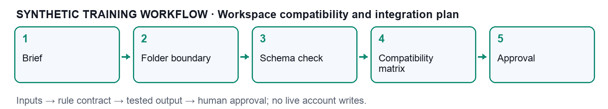

# Activity 01 — Workspace compatibility and integration plan

**Course:** Claude Cowork for Digital Marketing | TGS-2023018659 | v8.0

**Time:** 30 minutes | **Mapping:** LO1; K1 K2 K3 A1 A2

## Goal

Assess whether a local marketing workspace and an optional connector satisfy a read-only integration plan.

## What you will produce

compatibility-matrix.csv; test-evidence.csv; integration-notes.md; change-proposal.md

## Workflow

## Tools and boundaries

Claude Cowork access through a currently supported surface; desktop for local-folder access. A spreadsheet or text editor is sufficient for independent verification. Optional connector paths are design exercises unless an authorised sandbox is available. This activity is self-contained; no live customer, ad or email account is required.

## Input contract

component, interface, input_format, permission, owner, status

## Mechanism

Cowork receives only the chosen working folder; local files and optional connected services cross distinct boundaries. A compatibility gate precedes analysis.

Evaluate desktop availability, file encoding, column names, currency, timezone, connection permissions and intended output. A successful file read is insufficient evidence of semantic compatibility.

## Detailed procedure

1. Download or copy the complete activity-01-workspace-compatibility folder. Keep input/ unchanged and create a separate output/ folder for your work.

2. Read assets/brand-source.md, assets/claim-ledger.csv and input/mock-data.csv. Check the campaign period, SGD currency and synthetic identifiers before analysis.

3. Open workflow.png and read the input contract. Record the responsible owner and read-only boundary in output/integration-notes.md.

4. Build a ten-row compatibility checklist: UTF-8, required fields, unique grain, SGD currency, Singapore timezone, source date, folder scope, owner identity, read permission and write-disabled state. Mark the first eight Pass and the final two Blocked in the supplied worked-checks fixture.

5. Compute8/10=80% from worked-checks.csv. Do not treat this planning percentage as permission to connect. Map each blocked item to an owner and resolution request.

6. In an available Claude Cowork surface, start a new task. For local-folder access use the desktop workflow documented by Anthropic; choose only this activity folder. For web/cloud work upload the relevant synthetic files through the supported interface.

7. Copy Prompt 1 from prompts.pdf. Attach the mock-data.csv, approved brand sources and the activity guide. Ask Claude to explain any missing or incompatible fields before generating conclusions.

8. Compare the proposed plan with this activity mechanism: Cowork receives only the chosen working folder; local files and optional connected services cross distinct boundaries. A compatibility gate precedes analysis. Reject any proposed send, publication, credential change or live account action.

9. Copy Prompt 2 and request compatibility-matrix.csv in output/. Use the exact fields component, interface, input_format, permission, owner, status where applicable. Preserve raw values and distinguish course contract fields from vendor schemas.

10. Independently check the worked example: 8 passed / 10 applicable × 100 = 80%; two blocked checks prevent a live connection. Use a spreadsheet or hand calculation. Record observed values alongside expected values in output/test-evidence.csv.

11. Inject or inspect the deliberate failure: A CSV is readable but its currency is USD while the brief specifies SGD. Use Prompt 3 to isolate a minimal failing row or source claim. Do not permit silent corrections to the raw source.

12. Apply the bounded recovery: Quarantine the input, request a correctly labelled export, then repeat the currency and totals tests. Save a new correction copy, record what changed and rerun the affected checks.

13. Complete each acceptance check below and record pass/fail, filename, rule version and date. Keep failed evidence rather than deleting it.

14. Write output/change-proposal.md: Add a currency check and an explicit owner sign-off before admitting new source exports. Include owner, affected interface, test plan and rollback trigger.

15. Use Prompt 4 to obtain a concise review memo with source links, unresolved limits and an explicit Draft or Candidate state. Human review is required before any real campaign action.

16. Submit only the activity outputs, test evidence and change proposal to the trainer. Do not submit real customer data, credentials, copyrighted reference ebooks or live-account exports.

## Worked verification

Separate worked-example fixtures: worked-checks.csv(A01),claim-audit.csv(A02),source-campaigns.csv and analytics-campaigns.csv(A03),raw-tracking.csv(A04),dirty-export.csv(A07),initial-asset-manifest.csv(A10). These support the worked calculations; mock-data.csv may be a summary/error ledger rather than the raw input.

Compatibility rate = passed checks / applicable checks × 100

8 passed / 10 applicable × 100 = 80%; two blocked checks prevent a live connection.

## Acceptance checks

- Folder boundary excludes personal Downloads and credentials.

- All four components have owners and declared permissions.

- Conditional interfaces remain blocked until acceptance evidence exists.

- Raw input remains unchanged; each result names its evidence file.

## Troubleshooting

**Failure:** A CSV is readable but its currency is USD while the brief specifies SGD.

**Recovery:** Quarantine the input, request a correctly labelled export, then repeat the currency and totals tests.

## Completion boundary

A generated artifact or fixture pass does not prove a live connector, campaign send, website tag installation or external publication. Record the exact work you performed.

## Prompt pack

Use prompts.pdf; prompts.md contains the same editable text.

## Sources

- Anthropic Cowork product: https://claude.com/product/cowork

- Anthropic Skills: https://support.claude.com/en/articles/12512176-what-are-skills

- MCP architecture: https://modelcontextprotocol.io/docs/learn/architecture